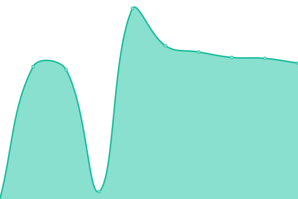

# [📈 Live Status](https://dioptra-io.github.io/iris-uptime): <!--live status--> **🟩 All systems operational**

This repository contains the open-source uptime monitor and status page for [Iris](https://iris.dioptra.io/), powered by [Upptime](https://github.com/upptime/upptime).

With [Upptime](https://upptime.js.org), you can get your own unlimited and free uptime monitor and status page, powered entirely by a GitHub repository. We use [Issues](https://github.com/dioptra-io/iris-uptime/issues) as incident reports, [Actions](https://github.com/dioptra-io/iris-uptime/actions) as uptime monitors, and [Pages](https://dioptra-io.github.io/iris-uptime) for the status page.

<!--start: status pages-->
<!-- This summary is generated by Upptime (https://github.com/upptime/upptime) -->
<!-- Do not edit this manually, your changes will be overwritten -->
<!-- prettier-ignore -->
| URL | Status | History | Response Time | Uptime |
| --- | ------ | ------- | ------------- | ------ |
|  [Iris Website](https://iris.dioptra.io) | 🟩 Up | [iris-website.yml](https://github.com/dioptra-io/iris-uptime/commits/HEAD/history/iris-website.yml) | 

 342ms
     
 | 

<a href="https://dioptra-io.github.io/iris-uptime/history/iris-website">100.00%</a>
    

|  [Iris Production API](https://api.iris.dioptra.io/status) | 🟩 Up | [iris-production-api.yml](https://github.com/dioptra-io/iris-uptime/commits/HEAD/history/iris-production-api.yml) | 

 7634ms
     
 | 

<a href="https://dioptra-io.github.io/iris-uptime/history/iris-production-api">99.84%</a>
    

|  [Iris Development API](https://api.dev.iris.dioptra.io/status) | 🟩 Up | [iris-development-api.yml](https://github.com/dioptra-io/iris-uptime/commits/HEAD/history/iris-development-api.yml) | 

 2164ms
     
 | 

<a href="https://dioptra-io.github.io/iris-uptime/history/iris-development-api">100.00%</a>
    

<!--end: status pages-->

[**Visit our status website →**](https://dioptra-io.github.io/iris-uptime)

## 📄 License

- Powered by: [Upptime](https://github.com/upptime/upptime)
- Code: [MIT](./LICENSE) © Sorbone Université
- Data in the `./history` directory: [Open Database License](https://opendatacommons.org/licenses/odbl/1-0/)
